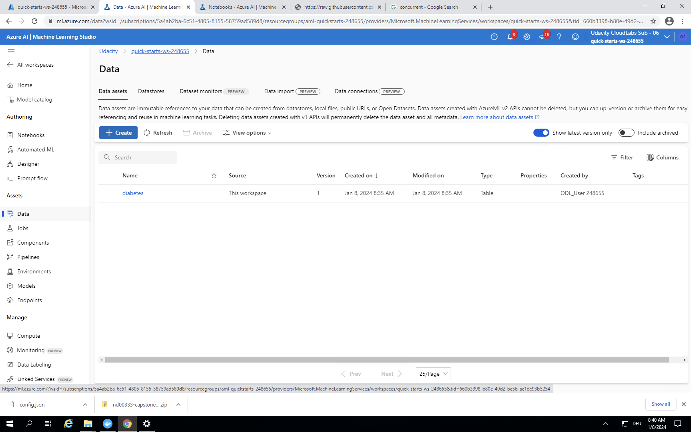

# Capstone Project: Diabetes prediction

## Table of content
* [Overview](#overview)
* [Project Set Up and Installation](#project-set-up-and-installation)
* [Dataset](#dataset)
* [Automated ML](#automated-ml)
* [Hyperparameter Tuning](#hyperparameter-tuning)
* [Screen Recording](#screen-recording)
* [References](#references)

## Overview
The dataset utilized in this project was sourced from the National Institute of Diabetes and Digestive and Kidney Diseases. The goal is to forecast whether a patient has diabetes based on specific diagnostic measurements. Two models were developed for this project: one using AutoML and another employing hyperparameters tuned through the HyperDrive model with a LogisticRegression classifier. Subsequently, we assessed the performance of both models, deploying the one with the superior performance and integrating it for consumption.

###### Source: (https://medium.com/microsoftazure/9-advanced-tips-for-production-machine-learning-6bbdebf49a6f)

The AutoML experiment has a 78.39% accuracy while the HyperDrive experiment gave a 77.08%. Hence the AutoML model was registered as the best model and deployed as a web service. 


## Project Set Up and Installation

### AutoML Experiment in 'automl.ipynb' Notebook:

1. **Upload Notebooks:** Begin by uploading the necessary notebooks to the AzureML workspace.

2. **Compute Instance:** Create a new compute instance

3. **Compute Cluster:** Set up a CPU compute cluster for model training.

4. **Dataset Registration:** Register the Kaggle dataset as "diabetes_data_set" in the workspace and retrieve it later in the ML experiment.

5. **Experiment Execution:**
   - Load the workspace, dataset, and compute cluster.
   - Create a new experiment named 'automl-exp.'
   - Configure AutoML settings and information.
   - Submit the experiment to train the model.
   - Utilize the RunDetails widget to display experiment details, including accuracy rates of the runs.
   - Retrieve and register the best model in the workspace.
   - Deploy the best model as a web service using Inference & deployment configuration settings.
   - Test the endpoint by sending a JSON payload and receiving a response.
   - Enable application insights and service logs.

### HyperDrive Experiment in 'hyperparameter_tuning.ipynb' Notebook:

1. **Load Dependencies:** Load the necessary components, including the workspace, dataset, and compute cluster.

2. **Experiment Setup:**
   - Create a new experiment named 'hyperdrive_exp.'
   - Define an early termination policy.
   - Utilize Random Parameter Sampling for hyperparameter tuning.
   - Configure experiment settings.

3. **Training Script:** Develop the 'train.py' script for training the model.

4. **Experiment Execution:**
   - Submit the HyperDrive experiment.
   - Use the RunDetails widget to visualize experiment details, such as accuracy rates of the runs.

## Dataset

The dataset comprises records of females aged 21 and older from Pima Indian heritage, totaling 768 entries. The primary goal is to predict the presence or absence of diabetes in patients based on specific diagnostic measurements, with features including the number of pregnancies, plasma glucose concentration, diastolic blood pressure, skinfold thickness, serum insulin levels, body mass index, diabetes pedigree function, age, and the target column "Outcome" indicating diabetes (1) or not (0). The dataset, available at https://www.kaggle.com/mathchi/diabetes-data-set, was downloaded from Kaggle, uploaded, and registered in the workspace using the 'upload from local file' option in the ML Studio GUI Datasets tab. It is registered as 'diabetes_data_set' and accessed through the 'Dataset_get_by_name(ws, dataset_name)' command in both notebooks, facilitating consumption via the Python SDK. The task involves predicting the "Outcome" column based on the given input features.



## Automated ML
Overview of the `automl` settings and configuration used for this experiment:

- "experiment_timeout_minutes": set to 30 minutes. The experiment will timeout after that period to avoid wasting resources.
- "max_concurrent_iterations": is set to 30. The max number of concurrent iterations to be run in parallel at the same time.
- "primary_metric" :  is set to 'accuracy', which is a sutible metric for classification problems. 
- "n_cross_validations": is set to 5, therefore the training and validation sets will be divided into five equal sets.
- "iterations": the number of iterations for the experiment is set to 20. It's a reasonable number and would provide the intendable result for the given dataset.
- compute_target: set to the project cluster to run the experiment.
- task: set to 'classification' since our target to predict whether the patient has diabetes or not.
- training_data: the loaded dataset for the project.
- label_column_name: set to the result/target colunm in the dataset 'Outcome' (0 or 1).
- enable_early_stopping: is enabled to terminate the experiment if the accuracy score is not showing improvement over time.
- featurization = is set to 'auto', it's an indicator of whether implementing a featurization step to preprocess/clean the dataset automatically or not. In our case, the preprocessing was applied for the numerical columns which normally involve treating missing values, cluster distance, the weight of evidence...etc.
- debug_log: errors will be logged into 'automl_errors.log'. 

### Results
The best model has resulted from the AutoML experiment from VotingEnsemble model. The Voting Ensemble model takes a majority vote of several algorithms which makes it surpass individual algorithms and minimize the bias. The best model has a 78.39% accuracy rate. 


#### `RunDetails` widget of best model screenshot 


#### Best model run id screenshot
We can get the RunID from the provided notebook or simply look in the model section, after we registered our model.


### How to improve the project in the future:
- Interchange n_cross_validations value between (2 till 7) and see if the prediction accuracy improved by tuning this parameter. 
- Increase the number of iterations this could lead to more improved results by testing more machine learning algorithms and run the experiment using them. 

## Hyperparameter Tuning

For the HyperDrive experiment, I opted for a LogisticRegression classifier model, given the nature of our target as a classification problem with binary outcomes (0 or 1). Logistic regression proves effective in such scenarios, utilizing the probability of a particular class occurrence. The model employs a logistic model function, constituting a binary regression form, and is trained using the provided 'train.py' script.

In configuring the HyperDrive experiment, I utilized the RandomParameterSampling for tuning hyperparameters, specifically '--C' (inverse of regularization) and '--max_iter' (maximum number of iterations). Discrete values, set as 'choice,' were assigned for both tuned parameters: '--C' with choices (0.001, 0.01, 0.1, 1.0, 10.0, 50.0, 100, 1000) and '--max_iter' with choices (10, 50). RandomParameterSampling was chosen for its swift performance, straightforward approach, and ability to provide a random, unbiased search in the overall parameter space. This approach is resource-efficient and supports the early termination policy for low-performance runs, saving computational resources. While Grid Sampling could offer an exhaustive search, the consideration of resource budget led to the selection of RandomParameterSampling.

To enhance resource utilization further, an early termination policy was incorporated into the experiment submission. BanditPolicy was employed with parameters evaluation_interval=2 and slack_factor=0.1, serving as an early stopping policy to automatically terminate underperforming and delayed runs. The Bandit Policy concludes runs if the primary metric falls outside the specified slack factor compared to the highest-performing run, contributing to improved computational efficiency.

### Results
The best performing model has a 74.4% accuracy rate with --C = 50 and --max_iter = 50. 

#### `RunDetails` widget screenshot of the best model


#### Best model run id screenshot


### How to improve the project in the future:
In refining the experiment, I recommend exploring the impact of regularization by trying a uniform range between 1 and 5 for the '--C' parameter. This will provide insights into the overall improvement in performance and the model's generalization capability. Additionally, consider extending the range for '--max_iter' to cover values such as 100 and 150, assessing how tuning the number of iterations affects the model's performance.

To diversify the experimentation, contemplate incorporating XGBoost and LightGBM models into the mix. Explore a broader range of hyperparameter options for these models to fine-tune their performance. This can offer a more comprehensive understanding of the models' behavior under various configurations.

For early termination policies, experiment with Median stopping and Truncation selection. Median stopping terminates runs based on the running averages of primary metrics, computing averages across all training runs and eliminating the worse-performing runs. This strategy can help improve efficiency by focusing resources on more promising configurations. Evaluate the effectiveness of these policies in enhancing the overall efficiency and effectiveness of the experiment.

## Model Deployment
The AutoML experiment has a 78% accuracy while the HyperDrive experiment gave a 77%. The AutoML model exceeded the HyperDrive performance. Hence was registered as the best model and deployed as a web service. The application insights was enabled.

Also, we have created inference configuration and edited deploy configuration settings for the deployment. The inference configuration and settings explain the set up of the web service that will include the deployed model. Environment settings and scoring.py script file should be passed the InferenceConfig. The deployed model was configured in Azure Container Instance(ACI) with cpu_cores and memory_gb parameters initialized as 1. 

```
inference_config = InferenceConfig(entry_script='scoring.py',
                                   environment=environment)
service_name = 'automl-deploy-1'
deployment_config = AciWebservice.deploy_configuration(cpu_cores=1, memory_gb=1)

service = Model.deploy(workspace=ws,
                       name=service_name,
                       models=[model],
                       inference_config=inference_config,
                       deployment_config=deployment_config,
                       overwrite=True
                      )
service.wait_for_deployment(show_output=True)
```

#### Best Model screenshot


A two sets of test records were passed to the endpoint to predict the result and use the service. The test data payload was passed to an instance of the endpoint model named "service". The prediction result was [1, 0] which indicates that only the first patient has diabetes. 

```
data = [{
           "Pregnancies": 6, 
             "Glucose": 148, 
             "BloodPressure": 72, 
             "SkinThickness": 35, 
             "Insulin": 0, 
             "BMI": 33.5, 
             "DiabetesPedigreeFunction": 0.627, 
             "Age": 50
           },
          {
            "Pregnancies": 1, 
             "Glucose": 85, 
             "BloodPressure": 66, 
             "SkinThickness": 29, 
             "Insulin": 20, 
             "BMI": 26.5, 
             "DiabetesPedigreeFunction": 0.351, 
             "Age": 31
          },
      ]
  # test using service instance
  input_data = json.dumps({
  'data': data
   })

   output = service.run(input_data)
   print(output)
```

## Screen Recording


## Standout Suggestions
*TODO (Optional):* This is where you can provide information about any standout suggestions that you have attempted.
